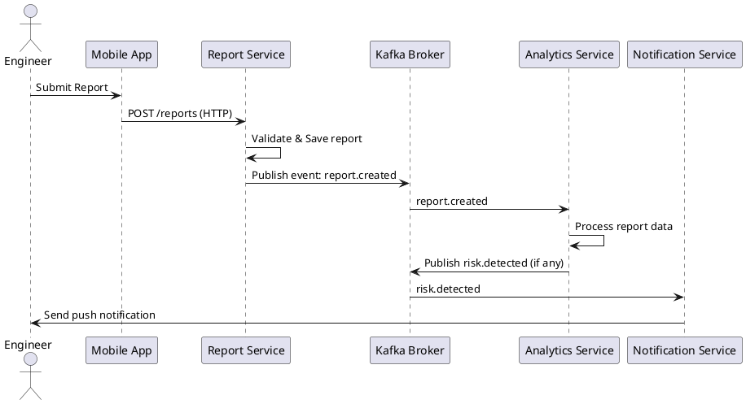
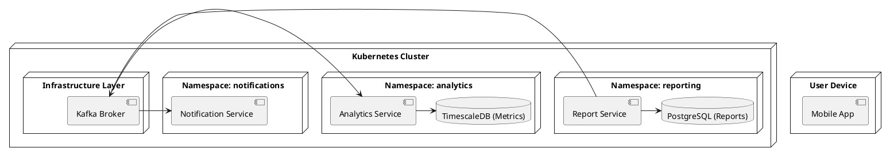

 

 
# **ЛАБОРАТОРНА РОБОТА №3**

 **Тема: Моделювання взаємодії сервісів**

 **Мета роботи**

Змоделювати потоки даних та взаємодію сервісів у розподіленій системі, визначити характеристики синхронних та асинхронних викликів, побудувати Sequence Diagram та Deployment Diagram.

 
# **1. Теоретичні відомості**

У розподілених програмних системах сервіси взаємодіють між собою через обмін запитами або подіями. Взаємодія може бути:

# **1. Синхронною**

Один сервіс викликає інший через HTTP або gRPC і очікує відповідь. Переваги: простота реалізації. Недоліки: затримки та тісне зв’язування.

# **2. Асинхронною**

Сервіс публікує подію в брокер повідомлень (Kafka, RabbitMQ). Інші сервіси підписані на подію та обробляють її незалежно. Переваги: масштабованість, відмовостійкість.

У складних системах важливими є:

* **Idempotency** — повторний виклик операції не змінює результат.
* **Fault tolerance** — використання retry, circuit breaker, dead-letter queue.
* **Saga pattern** — узгодження транзакцій між сервісами.

Для моделювання взаємодії використовуються:

* **Sequence Diagram** — порядок викликів між сервісами;
* **Deployment Diagram** — відображення серверів, контейнерів та розгортання;
* **C4 Model** — компонентні та контейнерні діаграми.

---

# **2. Завдання до роботи**

Варіант: **Подання звіту з будівельного майданчика**.

1. Вибрати сценарій взаємодії сервісів.
2. Описати послідовність у вигляді Sequence Diagram.
3. Вказати типи взаємодії (HTTP/gRPC/Message Queue).
4. Побудувати Deployment Diagram.

---

# **3. Обраний сценарій**

**Сценарій: Подання звіту з будівельного майданчика інженером.**

**Опис процесу:**

1. Мобільний застосунок інженера формує звіт про виконані роботи.
2. Звіт надсилається в **Report Service (HTTP REST)**.
3. Report Service створює запис і публікує подію **report.created** у Kafka.
4. **Analytics Service** отримує подію, обробляє дані, обчислює ризики.
5. У разі проблем analytics.publish → event: **risk.detected**.
6. **Notification Service** отримує подію та надсилає push-повідомлення інженеру.

---

# **4. Протокол розв’язання задач**

## **4.1 Sequence Diagram (PlantUML)**

# Типи взаємодії:

* App → Report Service: **HTTP REST**
* Report Service → Kafka: **Message Queue (async)**
* Kafka → Analytics Service: **Message Queue (async)**
* Kafka → Notification Service: **Message Queue (async)**
* Notification Service → Mobile App: **Push Notification**

---

## **4.2 Deployment Diagram (PlantUML)**

---
 

# **6. Контрольні запитання**

1. Які є види міжсервісної взаємодії?

Синхронна (HTTP/gRPC), асинхронна (черги, події).

  2. У чому різниця між синхронною та асинхронною взаємодією?

Синхронна — чекає на відповідь; асинхронна — надсилає подію без очікування.

 3. Що таке брокер повідомлень?

Система, яка приймає, зберігає та доставляє події між сервісами.

 4. Які переваги має подійно-орієнтована архітектура?

Незалежність сервісів, масштабованість, стійкість до збоїв.

 5. Для чого використовують діаграму послідовності?

Для опису порядку викликів між компонентами.

 6. Що означає ідемпотентність сервісу?

Повторна обробка того самого повідомлення не змінює результат.

 7. Як забезпечити надійну доставку повідомлень?

Повторні спроби, ACK/NACK, dead-letter queue, відстеження offset.

 
