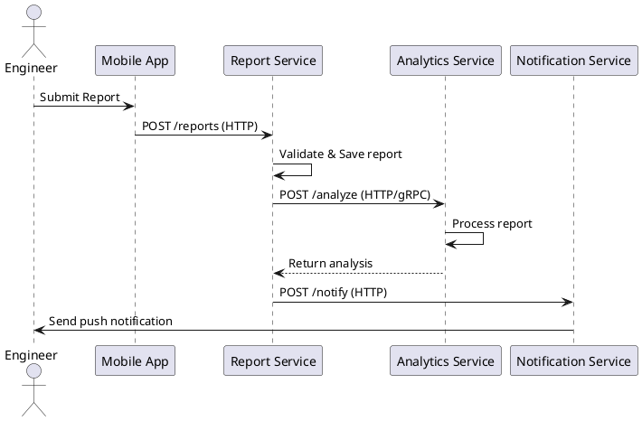
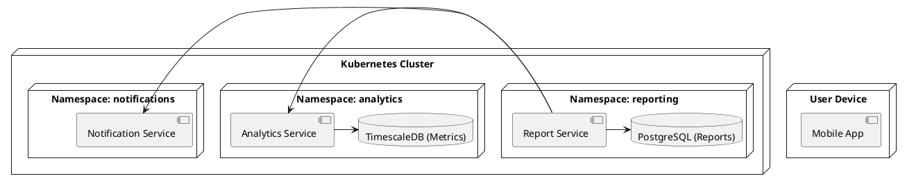

# **ЛАБОРАТОРНА РОБОТА №3**

 **Тема: Моделювання взаємодії сервісів**

 **Мета роботи**

Змоделювати потоки даних і взаємодію сервісів у розподіленій системі, використовуючи **лише синхронні виклики (HTTP/gRPC)**, побудувати Sequence Diagram і Deployment Diagram.

---

# **1. Теоретичні відомості**

У розподілених системах сервіси можуть взаємодіяти:

### **1. Синхронно**

Сервіс викликає інший сервіс і очікує на відповідь.
*Протоколи:* HTTP REST, gRPC.
Переваги: простота реалізації, контроль результатів.
Недоліки: затримки при недоступності сервісу.

### **2. Локальні черги всередині сервісів**

Для обробки повідомлень у межах сервісу без зовнішніх брокерів.

Ключові аспекти моделювання взаємодії сервісів:

* **Idempotency** — повторне виконання операції не змінює результат.
* **Fault tolerance** — retry, circuit breaker, dead-letter queue (локальні).
* **Saga pattern** — узгодження послідовних транзакцій між сервісами.

Для моделювання використовуються:

* **Sequence Diagram** — порядок викликів між сервісами.
* **Deployment Diagram** — розгортання контейнерів та серверів.

---

# **2. Завдання до роботи**

Варіант: **Подання звіту з будівельного майданчика**.

1. Вибрати сценарій взаємодії сервісів.
2. Описати послідовність у вигляді Sequence Diagram.
3. Вказати типи взаємодії (HTTP/gRPC).
4. Побудувати Deployment Diagram.

---

# **3. Обраний сценарій**

**Сценарій:** Подання звіту інженером про виконані роботи на будівельному майданчику.

**Процес:**

1. Мобільний застосунок інженера формує звіт.
2. Звіт надсилається у **Report Service (HTTP REST)**.
3. Report Service зберігає дані у базі.
4. Report Service синхронно викликає **Analytics Service (HTTP/gRPC)** для обробки та оцінки ризиків.
5. Результат обробки повертається у Report Service.
6. Report Service викликає **Notification Service (HTTP REST)** для надсилання повідомлення інженеру.

---

# **4. Sequence Diagram (PlantUML)**

**Типи взаємодії:**

* App → Report Service: **HTTP REST**
* Report Service → Analytics Service: **HTTP REST/gRPC**
* Report Service → Notification Service: **HTTP REST**
* Notification Service → Mobile App: **Push Notification**

---

# **5. Deployment Diagram (PlantUML)**

# **7. Контрольні запитання**

1. Які є види міжсервісної взаємодії?
   *Синхронна (HTTP/gRPC), локальні черги.*

2. У чому різниця між синхронною та асинхронною взаємодією?
   *Синхронна чекає на відповідь, асинхронна — обробляється незалежно.*

3. Що таке брокер повідомлень?
   *У цій роботі не використовується.*

4. Які переваги подійно-орієнтованої архітектури?
   *Масштабованість, стійкість, слабке зв’язування.*

5. Для чого використовують діаграму послідовності?
   *Для опису порядку викликів між компонентами.*

6. Що означає ідемпотентність сервісу?
   *Повторна обробка того самого запиту не змінює результат.*

7. Як забезпечити надійну доставку повідомлень у синхронному варіанті?
   *HTTP статус, retry, логування помилок.*

 
