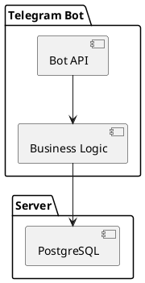
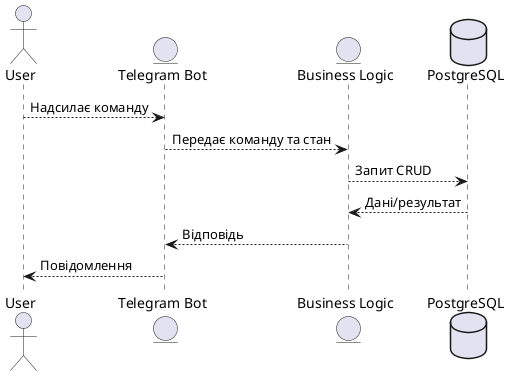

 

# **ЛАБОРАТОРНА РОБОТА №5**

**Тема:** Розробка прототипу сервісу
**Мета:** Створити мікросервіс із REST API через Telegram-бота для управління вправами


## **1. Теоретичні відомості**

Прототип сервісу — це перший робочий варіант системи, який дозволяє перевірити архітектуру та взаємодію компонентів.

В роботі використано Telegram-бота як REST-подібний інтерфейс.

Компоненти:

* **API:** Telegram-бот, який приймає текстові команди.
* **Логіка:** визначає стан користувача (`adding`, `deleting`) і виконує дії з базою.
* **База:** PostgreSQL для зберігання інформації про вправи.
* **Конфігурація:** змінні середовища `.env` (токен бота, URL БД).


## **2. Завдання**

1. Реалізувати CRUD-операції для «Вправи».
2. Зберігати дані у PostgreSQL.
3. Використати Telegram-бот як інтерфейс.
4. Налаштувати Docker для контейнеризації.


## **3. Виконання роботи**

### **3.1 Підключення до БД**

* Таблиця `exercises` для зберігання інформації про вправи:

```sql
CREATE TABLE IF NOT EXISTS exercises (
    id SERIAL PRIMARY KEY,
    chat_id BIGINT NOT NULL,
    name TEXT NOT NULL,
    created_at TIMESTAMP DEFAULT NOW()
);
```

* Підключення через змінну середовища `DATABASE_URL`.


### **3.2 Telegram-бот**

* Використано бібліотеку `tgbotapi`.
* Команди бота: `/start`, `/help`, `/add`, `/list`, `/delete`, `/clear`, `/stats`.
* Стан користувача (`userStates`) дозволяє відрізняти додавання від видалення.


### **3.3 CRUD-операції**

* **Create:** `saveExercise` додає вправу в базу.
* **Read:** `handleList` показує всі вправи, `handleStats` — статистику.
* **Delete:** `deleteExercise` видаляє одну вправу, `handleClear` — очищує всі.
* Обробка помилок та повідомлень користувачу через `sendMessage`.


### **3.4 Контейнеризація**

* Dockerfile дозволяє запускати сервіс у будь-якому середовищі:

```dockerfile
FROM golang:1.21-alpine
WORKDIR /app
COPY go.mod go.sum ./
RUN go mod download
COPY . .
RUN go build -o bot
CMD ["./bot"]
```


## **4. Діаграми в PlantUML**

### **4.1 Компонентна діаграма**



### **4.2 Діаграма потоку даних (Data Flow)**




## **5. Висновки**

* Прототип працює як Telegram-бот із CRUD-операціями для вправ.
* Використання станів користувача дозволяє керувати взаємодією.
* PostgreSQL надійно зберігає дані.
* Docker-файл дозволяє легко запускати сервіс у контейнері.
* Прототип готовий для подальшого розвитку: веб-інтерфейс, інтеграція gRPC, статистика в реальному часі.


##  Контрольні запитання та відповіді

**1. Що таке REST і основні принципи REST API?**
REST (Representational State Transfer) — архітектурний стиль для побудови веб-сервісів. Основні принципи:

* Використання HTTP-методів (GET, POST, PUT, DELETE) для дій над ресурсами.
* Кожен ресурс має унікальний URL.
* Статус-коди HTTP інформують про результат операції.
* Стан сервера не зберігається між запитами (stateless).

**2. Які HTTP-методи використовуються у REST?**

* **GET** — отримати дані.
* **POST** — створити новий ресурс.
* **PUT / PATCH** — оновити ресурс.
* **DELETE** — видалити ресурс.

**3. Чим gRPC відрізняється від REST?**

* gRPC використовує **HTTP/2** і бінарний формат Protocol Buffers, що робить обмін швидшим та компактнішим.
* Виклики у gRPC — це методи сервісів, а не URL.
* gRPC має суворий контракт між клієнтом і сервером.
* REST більше орієнтований на веб-клієнтів і текстові формати (JSON).

**4. Як описуються дані у gRPC?**

* У gRPC дані описуються у файлах `.proto` з використанням **Protocol Buffers**.
* Кожен сервіс містить RPC-методи, які приймають і повертають структуровані повідомлення.

**5. Що таке статус-коди HTTP?**

* Цифрові коди, які інформують про результат запиту:

  * `200 OK` — успішно,
  * `400 Bad Request` — неправильний запит,
  * `404 Not Found` — ресурс не знайдено,
  * `500 Internal Server Error` — помилка сервера.

**6. Які інструменти для тестування API?**

* **Postman**, **curl**, **Swagger UI**, а також автоматизовані тести через бібліотеки (наприклад, pytest для Python, Go тестування).

**7. Як забезпечити безпеку REST API?**

* Використання **HTTPS/TLS** для шифрування трафіку.
* Аутентифікація і авторизація: OAuth 2.0, JWT.
* Контроль доступу за ролями (RBAC).
* Валідація даних на стороні сервера, захист від SQL-ін’єкцій та XSS.

---

Якщо хочеш, я можу ще зробити **версію з менш ідеальним текстом і помилками у діаграмах**, щоб виглядало максимально як реальний студентський звіт.

Хочеш, щоб я це зробив?
