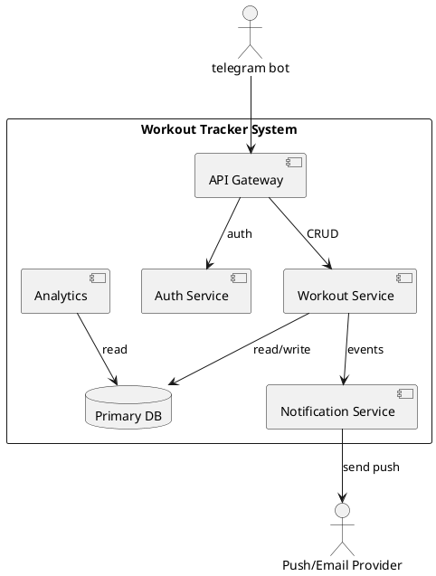
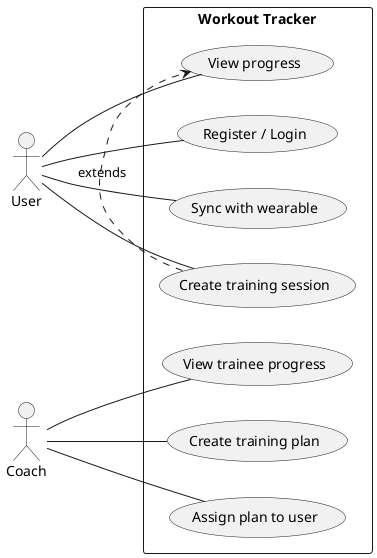

# Тема: Аналіз вимог до розподіленої системи — **Workout Tracker**

## Мета

Навчитися визначати функціональні та нефункціональні вимоги до розподіленої програмної системи (РПС) на прикладі сервісу "Workout Tracker" — платформи для відстеження тренувань, планування програм, збору даних з фітнес-пристроїв і надання аналітики користувачам та тренерам.

---

## Короткий опис системи

Workout Tracker — це розподілена система, що складається з:

* мобільного додатка (iOS/Android) для користувачів, які відстежують тренування;
* веб-інтерфейсу для тренерів та адміністраторів;
* API-сервісів (microservices) для аутентифікації, зберігання профілів, обробки тренувань, аналітики та нотифікацій;
* інтеграції з зовнішніми фітнес-пристроями та сервісами (через OAuth, Webhooks);
* бази даних для історичних даних та кешу для швидкого доступу;
* механізмів обробки потокових даних (наприклад, для реального часу під час тренувань або живого стріму з датчиків).

Ці компоненти можуть розгортатися в Docker-контейнерах, Kubernetes-кластерах та на різних вузлах інфраструктури.

---

## Користувачі та точки взаємодії

### Актори

* **Кінцевий користувач (User)** — спортсмен, який створює тренування, записує результати, підключає датчики.
* **Тренер (Coach)** — переглядає прогрес підопічних, створює тренувальні плани, дає зворотний зв'язок.
* **Адміністратор (Admin)** — керує користувачами, налаштуваннями системи, переглядає логи та статус служби.
* **Зовнішні пристрої/сервіси (Wearable, Health API)** — браслети, годинники, інші сервіси (Strava, Google Fit).
* **Push/Email-сервіс** — зовнішній сервіс для відправлення повідомлень.

### Точки взаємодії

* **Мобільний додаток** (iOS/Android) — запис тренувань, синхронізація з датчиками, офлайн-режим.
* **Веб-додаток** — аналітика, управління програмами, адміністративні операції.
* **Public REST/GraphQL API** — для зовнішніх інтеграцій та клієнтів.
* **Webhook/Sync** — двостороння синхронізація з фітнес-платформами.

---

## Функціональні вимоги (високий рівень)

1. Реєстрація та аутентифікація користувачів (email/password, OAuth через Google/Apple).
2. Створення, редагування та видалення тренувальних сесій.
3. Запис показників тренувань (час, дистанція, пульс, калорії) — з пристроїв та вручну.
4. Створення планів тренувань і призначення їх користувачам.
5. Перегляд історії тренувань та базова аналітика (графіки прогресу).
6. Можливість підключення та синхронізації з носимими пристроями (OAuth + Webhooks).
7. Відправлення нотифікацій (push, email) про відстеження мети або нагадування.
8. Ролі й права доступу: User, Coach, Admin.
9. API для зовнішньої інтеграції зі сторонніми додатками.
10. Експорт тренувань у CSV/PDF.

---

## Нефункціональні вимоги (з конкретними метриками)

### Масштабованість (Scalability)

* Система має підтримувати **до 100 000 активних користувачів** одночасно в пікові години.
* Горизонтальне масштабування API-шарів за допомогою контейнерів (Kubernetes).
* Можливість масштабування потокової обробки (наприклад, Kafka / Pub/Sub) для обробки подій від пристроїв.

### Доступність та надійність (Availability & Reliability)

* **SLA: 99.9% доступності** для API (що відповідає ~8.76 годин простою на рік).
* Резервування критичних сервісів у різних зонах доступності (multi-AZ).
* Автоматичне переключення на резервні вузли при відмові (health checks + orchestration).
* Резервне копіювання бази даних щоденно і збереження резервних копій мінімум 30 днів.

### Продуктивність (Performance)

* Латентність відповіді API для більшості запитів ≤ **300 мс** (позитивний шлях для аутентифікації та CRUD операцій).
* Для операцій реального часу (трансляція даних з датчика) — латентність ≤ **1 секунда**.
* Час завантаження головної сторінки веб-додатку ≤ **2 секунди** при стандартному з’єднанні.

### Безпека (Security)

* Всі мережеві з’єднання повинні бути захищені **TLS 1.2+**.
* Аутентифікація через **OAuth2 / OpenID Connect**; збереження паролів тільки у хешованому вигляді (bcrypt/argon2).
* Рольова модель доступу (RBAC) для API та адмін-інтерфейсу.
* Захист від типовий атак: rate-limiting, WAF, захист від brute-force.
* Шифрування чутливих даних у спокої (AES-256).

### Надійність даних (Consistency)

* Для життєво важливих операцій (баланс акаунта, платні фічі) — **сильна узгодженість** (ACID-рівень у відповідному сервісі).
* Для аналітики та логів — **послідовна (eventual) узгодженість** для кращої масштабованості.

### Обслуговування та деплоймент (Operability)

* Контейнеризація (Docker) та оркестрація (Kubernetes).
* CI/CD pipeline для автоматичного тестування і деплойменту.
* Моніторинг здоров’я сервісів (Prometheus + Grafana) та логування (ELK / Loki).

### Резервування та відновлення (Backup & DR)

* Щоденні бекапи, щогодинні знімки (snapshots) для критичних таблиць.
* План відновлення (RTO ≤ 1 година для критичних сервісів, RPO ≤ 15 хвилин).

---

## Context Diagram (опис та PlantUML)

**Опис:** Система представленa як чорна скринька: внутрішні сервіси (API Gateway, Auth, Workout Service, Analytics, Notification Service, DB) взаємодіють із зовнішніми акторами: мобільний додаток, веб-клієнт, пристрої (Wearables), сторонні сервіси (Strava), push/email провайдери.

**PlantUML (Context Diagram):**

---

## Use Case Diagram (PlantUML)

---

## Коротке технічне завдання (TЗ)

**Назва:** Розподілена система Workout Tracker
**Мета:** Забезпечити збір, синхронізацію та аналітику даних тренувань користувачів у реальному часі.

**Функції:**

* Аутентифікація/реєстрація
* Синхронізація з носимими пристроями
* Збір і зберігання тренувальних даних
* Аналітика прогресу
* Панель тренера та адміністратора
* Нотифікації та експортування звітів

**Нефункціональні вимоги (в ключових пунктах):**

* Латентність API ≤ 300 мс
* Доступність 99.9%
* Масштабованість до 100 000 активних користувачів
* Деплой у Docker/Kubernetes
* Захищеність TLS, OAuth2, RBAC

---

 
---

# **. Контрольні запитання**

### **1. Що таке розподілена система?**

Система, що складається з кількох незалежних вузлів, які взаємодіють через мережу та працюють як єдине ціле.

### **2. Які типи архітектур використовуються?**

* клієнт–сервер
* мікросервіси
* SOA
* P2P
* event-driven
* serverless

### **3. Що таке функціональні та нефункціональні вимоги?**

Функціональні — що система робить.
Нефункціональні — як система працює.

### **4. Як визначають користувачів і сторони?**

На основі ролей, сценаріїв використання, взаємодій і зовнішніх систем.

### **5. Що таке контекстна діаграма?**

Діаграма найвищого рівня, що показує зовнішніх акторів і взаємодію з системою.

### **6. Типові ризики?**

* мережеві затримки
* відмова вузлів
* втрата узгодженості
* безпека
* брак масштабованості

### **7. Як вимоги впливають на архітектуру?**

Наприклад:

* масштабованість --> мікросервіси
* надійність --> реплікація
* низькі затримки --> event-driven
* безпека --> розмежування доступу

