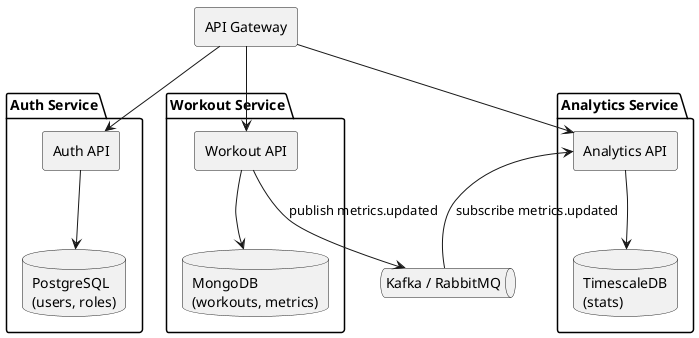

# **ЛАБОРАТОРНА РОБОТА №2**

## **Тема: Проєктування мікросервісної архітектури (на прикладі Workout Tracker)**

## **Мета роботи**

Навчитися декомпозувати розподілену систему на мікросервіси, визначати їхні межі відповідальності (bounded context), обирати бази даних, API, черги повідомлень та будувати діаграми компонентів/C4 Model Level 2.

---

# **1. Теоретичні відомості**

Мікросервісна архітектура — це підхід до побудови програмних систем, у якому великий застосунок розділяється на набір невеликих, незалежних сервісів. Кожен сервіс:

* виконує одну бізнес-функцію;
* має власну базу даних;
* розгортається незалежно;
* взаємодіє через REST/gRPC або через брокери подій (Kafka, RabbitMQ);
* масштабується окремо від інших.

### Переваги:

* горизонтальне масштабування окремих компонентів;
* висока відмовостійкість (збій одного сервісу не ламає систему);
* можливість вибору різних технологій;
* незалежні релізи.

### Недоліки:

* складні DevOps-процеси;
* потреба в централізованому моніторингу;
* складність трасування між сервісами;
* потреба у message broker, API gateway, service discovery (K8s, Consul).

### Ключові принципи:

* **Database per service** — кожен сервіс має власну БД;
* **Loose coupling** — слабке зв'язування між сервісами;
* **Independent deployability** — сервіс можна оновити без зупинки інших;
* **Bounded Context (DDD)** — чіткі межі відповідальності.

---

# **2. Завдання до роботи**

На основі системи **Workout Tracker**:

1. Визначити **2–3 основних мікросервіси**.
2. Для кожного сервісу визначити:

   * базу даних,
   * API (ендпоінти),
   * події або черги повідомлень.
3. Побудувати **Component Diagram** або **C4 Model Level 2**.

---

# **3. Виділені мікросервіси Workout Tracker**

Обрано **три ключові мікросервіси**, що відповідають за бізнес-логіку:

## **3.1. Auth Service**

**Відповідальність:**
Аутентифікація, авторизація, управління користувачами.

**API:**

* POST /auth/register
* POST /auth/login
* GET /auth/userinfo
* POST /auth/refresh

**База даних:**

* PostgreSQL (таблиці: users, roles, sessions)

**Черги/події:**

* user.created (для Notification Service або Analytics Service)

---

## **3.2. Workout Service**

**Відповідальність:**
Облік тренувань, наборів вправ, збереження показників, синхронізація з носимими пристроями.

**API:**

* POST /workouts
* GET /workouts/{id}
* GET /workouts/user/{id}
* POST /workouts/{id}/metrics
* POST /workouts/sync/wearable

**База даних:**

* MongoDB (зберігання структури тренувань й потокових даних пристроїв)

**Черги/події:**

* workout.finished
* metrics.updated → Analytics Service

---

## **3.3. Analytics Service**

**Відповідальність:**
Побудова графіків прогресу, агрегація метрик, довготривалі статистики.

**API:**

* GET /analytics/user/{id}/summary
* GET /analytics/workout/{id}/stats

**База даних:**

* TimescaleDB або ClickHouse (для агрегованих часових рядів).

**Черги/події:**

* metrics.updated (subscribed)
* workout.finished (subscribed)

---

# **4. Component  Diagram **

---

# **5. Протокол розв’язання задач**

1. Виходячи з системи Workout Tracker, визначено три bounded contexts:

   * автентифікація,
   * тренування,
   * аналітика.
     Це дозволило виокремити три незалежних мікросервіси.

2. До кожного сервісу підібрано відповідний тип бази даних:

   * Auth – реляційна (PostgreSQL);
   * Workout – документоорієнтована (MongoDB) через гнучку структуру даних тренувань;
   * Analytics – оптимізована для часових рядів (TimescaleDB).

3. Спроєктовано API-ендпоінти, необхідні для роботи кожного сервісу.

4. Визначено події та інтеграцію через чергу повідомлень (Kafka/RabbitMQ).

5. Побудовано **Component / C4 Level 2 Diagram**, що відображає взаємодію компонентів.

---

---

# **Контрольні запитання**

### **1. Що таке мікросервісна архітектура?**

Архітектурний стиль, де система складається з набору незалежних сервісів, кожен з чіткою бізнес-функцією.

### **2. У чому переваги мікросервісів?**

Масштабованість, відмовостійкість, автономність даних, гнучкість технологій, незалежні релізи.

### **3. Які недоліки?**

Складне тестування, необхідність DevOps-інфраструктури, труднощі моніторингу та трасування.

### **4. Що таке bounded context?**

Чітка область відповідальності сервісу в термінах DDD.

### **5. Чому "database per service" важливий?**

Уникає складної синхронізації, дозволяє незалежні релізи та зміну схеми БД.

### **6. Які є способи взаємодії між мікросервісами?**

* Синхронні (REST, gRPC)
* Асинхронні (Kafka, RabbitMQ, Webhooks)

### **7. Для чого потрібен API Gateway?**

Єдина точка входу, маршрутизація, rate-limiting, автентифікація, логування.

---

Якщо хочеш — **можу зробити PDF/Word**, або **додати Deployment Diagram**, або **доповнити C4 Model рівнями 1–3**.
